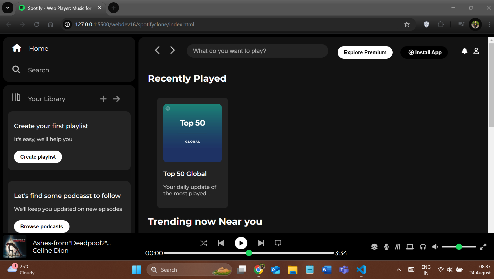

# Spotify Clone - Web Player 🎧

This is a **Spotify clone** web player created using only **HTML** and **CSS**. The project mimics the UI of Spotify's web player, featuring a responsive layout, music player controls, a sidebar, and trending charts. 

## 🌟 Features
- **Responsive Layout**: Works on desktop and adjusts for smaller screens.
- **Sidebar Navigation**: With options for Home, Search, and Your Library.
- **Music Player Controls**: Play, pause, volume control, and seek functionalities.
- **Recently Played**: Displays recently played tracks.
- **Trending & Featured Charts**: Showcases trending music and featured charts.
  
## 🚀 Live Demo
Check out the live demo here: [Spotify Clone Web Player](#) : Live demo link comming soon.

## 💻 Technologies Used
- **HTML5**: For structuring the web page.
- **CSS3**: For styling the web page and creating the Spotify-like UI.
  
## 📂 Project Structure

## 🎨 Screenshots
Here is a preview of the Spotify Clone Web Player:

## 📝 License
This project is not licensed. You are free to interpret and modify according to your use.

## 🤝 Contributing
Contributions, issues, and feature requests are welcome! Feel free to check and reach out on the links below.

## 👨‍💻 Author
GitHub: [sudiptadutta99](https://github.com/sudiptadutta99)
Twitter: [@sudiptadutta99](https://x.com/sudiptadutta99)

Thanks for checking out my project!
